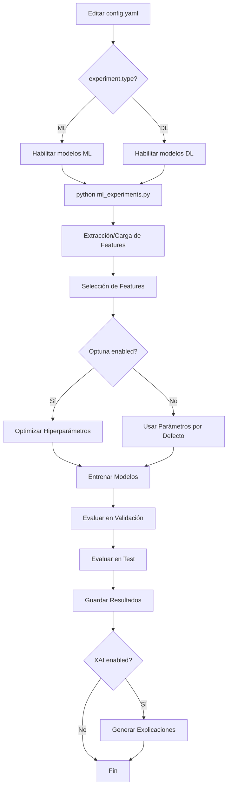

# 🧠 Sistema Unificado de Experimentos ML & DL
## Clasificación de Convulsiones en EEG

Sistema completo para experimentos de Machine Learning tradicional y Deep Learning con configuración unificada en YAML.

---

## 📁 Estructura de Archivos

```
experimentation/classic/
├── config.yaml           # ⭐ ÚNICO archivo de configuración (ML + DL)
├── ml_experiments.py     # ⭐ Script principal (maneja ML y DL)
├── dl_models.py          # Arquitecturas de Deep Learning (Transformer, CNN, LSTM, GRU)
└── README.md            # Este archivo
```

---

## 🚀 Uso Rápido

### **Opción 1: Machine Learning Tradicional**

```bash
# 1. Editar config.yaml:
#    - experiment.type = "ml"
#    - models.lr.enabled = true (o rf, svc, xgb...)
#    - deep_learning.enabled = false

# 2. Ejecutar:
python experimentation/classic/ml_experiments.py
```

### **Opción 2: Deep Learning**

```bash
# 1. Editar config.yaml:
#    - experiment.type = "dl"
#    - deep_learning.enabled = true
#    - dl_models.transformer.enabled = true (o cnn, lstm, gru...)
#    - models.*.enabled = false (deshabilitar ML)

# 2. Ejecutar:
python experimentation/classic/ml_experiments.py
```

---

## ⚙️ Configuración Detallada

### **config.yaml - Parámetros Principales**

#### 1️⃣ **Tipo de Experimento**
```yaml
experiment:
  type: "ml"  # Cambiar a "dl" para Deep Learning
```

#### 2️⃣ **Machine Learning - Activar Modelos**
```yaml
models:
  lr:
    enabled: true  # Logistic Regression
  rf:
    enabled: true  # Random Forest
  svc:
    enabled: true  # SVM
  xgb:
    enabled: true  # XGBoost
  knn:
    enabled: false # K-Nearest Neighbors
```

#### 3️⃣ **Deep Learning - Activar Modelos**
```yaml
deep_learning:
  enabled: true
  epochs: 50
  batch_size: 32
  data_format: "raw"  # "raw" o "features"

dl_models:
  transformer:
    enabled: true   # ⭐ Transformer para secuencias largas
  cnn:
    enabled: false  # CNN para features
  lstm:
    enabled: false  # LSTM para secuencias
  gru:
    enabled: false  # GRU (más rápido que LSTM)
```

#### 4️⃣ **Optimización con Optuna**
```yaml
optuna:
  enabled: true
  n_trials: 100  # Reducir a 30-50 para DL
```

#### 5️⃣ **Validación Cruzada**
```yaml
cross_validation:
  enabled: true  # Recomendado para ML, lento para DL
  n_folds: 5
```

#### 6️⃣ **Explicabilidad (XAI)**
```yaml
xai:
  enabled: true  # Solo para ML, muy lento para DL
  methods:
    shap:
      enabled: true
    lime:
      enabled: true
```

---

## 📊 Ejemplos de Configuración

### **Ejemplo 1: Comparar varios modelos ML sin optimización**

```yaml
experiment:
  type: "ml"

models:
  lr:
    enabled: true
  rf:
    enabled: true
  svc:
    enabled: true
  xgb:
    enabled: true

optuna:
  enabled: false  # Sin optimización, usar parámetros por defecto

cross_validation:
  enabled: true
  n_folds: 5

xai:
  enabled: true
```

### **Ejemplo 2: Optimizar Random Forest con Optuna**

```yaml
experiment:
  type: "ml"

models:
  rf:
    enabled: true  # Solo Random Forest
  lr:
    enabled: false
  svc:
    enabled: false
  xgb:
    enabled: false

optuna:
  enabled: true
  n_trials: 100

cross_validation:
  enabled: true
```

### **Ejemplo 3: Entrenar Transformer con Early Stopping**

```yaml
experiment:
  type: "dl"
  device: "cuda"  # Usar GPU

deep_learning:
  enabled: true
  epochs: 50
  batch_size: 32
  data_format: "raw"
  early_stopping:
    enabled: true
    patience: 10

dl_models:
  transformer:
    enabled: true
  cnn:
    enabled: false
  lstm:
    enabled: false

models:  # Deshabilitar todos los ML
  lr:
    enabled: false
  rf:
    enabled: false
  svc:
    enabled: false
  xgb:
    enabled: false

optuna:
  enabled: false  # Probar sin optimización primero

cross_validation:
  enabled: false  # Muy lento para DL

xai:
  enabled: false  # SHAP/LIME lentos para redes neuronales
```

### **Ejemplo 4: Optimizar Transformer con Optuna**

```yaml
experiment:
  type: "dl"
  device: "cuda"

deep_learning:
  enabled: true
  epochs: 30  # Menos épocas para optimización

dl_models:
  transformer:
    enabled: true

optuna:
  enabled: true
  n_trials: 30  # Menos trials (DL es lento)

cross_validation:
  enabled: false

xai:
  enabled: false
```

---

## 🔧 Requisitos de Instalación

### **Para Machine Learning:**
```bash
pip install pandas numpy scikit-learn xgboost tsfresh
pip install optuna shap lime matplotlib seaborn pyyaml
```

### **Para Deep Learning (adicional):**
```bash
pip install torch torchvision torchaudio --index-url https://download.pytorch.org/whl/cu118
pip install skorch
```

---

## 📈 Flujo de Trabajo



---

## 📂 Resultados Generados

Después de ejecutar, se generan:

```
images/results/
├── ml_test_metrics.png              # Tabla de métricas
├── optuna_history_*.html            # Historial de optimización
├── optuna_importance_*.html         # Importancia de hiperparámetros
└── optuna_slice_*.html              # Análisis por parámetro

images/xai/
├── lr_shap.png                      # Importancia SHAP
├── lr_lime.png                      # Importancia LIME
└── ... (para cada modelo)

data/processed/
├── features_train.csv               # Features extraídas
├── features_val.csv
├── features_test.csv
├── selected_features.csv            # Features seleccionadas
└── optuna_results/
    ├── optuna_results_lr.csv        # Resultados de optimización
    └── ...
```

---

## 🎯 Tips y Recomendaciones

### **Machine Learning:**
- ✅ Usar validación cruzada (cross_validation.enabled = true)
- ✅ Activar XAI para interpretabilidad
- ✅ Probar múltiples modelos simultáneamente
- ⚠️ Feature extraction puede tardar (usar features cacheadas si existen)

### **Deep Learning:**
- ✅ Usar GPU (experiment.device = "cuda")
- ✅ Activar Early Stopping (ahorra tiempo)
- ✅ Empezar sin optimización, luego usar Optuna
- ⚠️ Desactivar cross_validation (muy lento)
- ⚠️ Desactivar XAI (SHAP/LIME lentos para redes neuronales)
- ⚠️ Reducir optuna.n_trials a 30-50

### **Optimización:**
- Empezar con `optuna.enabled = false` para validar configuración
- Luego activar Optuna para buscar mejores hiperparámetros
- ML: 100 trials es razonable
- DL: 30-50 trials (cada trial tarda más)

---

## 🐛 Troubleshooting

**Error: "PyTorch/skorch no disponible"**
```bash
pip install torch skorch
```

**Error: "CUDA no disponible"**
- Cambiar en config.yaml: `experiment.device = "cpu"`
- O instalar CUDA Toolkit y PyTorch con soporte CUDA

**Error: "Features no encontradas"**
- Verificar que existan los CSV de ventanas en `data/processed/windowed/`
- Activar `feature_extraction.enabled = true` para extraerlas

**Entrenamiento muy lento en DL:**
- Reducir `deep_learning.epochs`
- Aumentar `deep_learning.batch_size` (si hay memoria suficiente)
- Reducir `optuna.n_trials` si está habilitado
- Desactivar `cross_validation.enabled`

---

## 📞 Soporte

Para preguntas o problemas:
1. Revisar este README
2. Verificar configuración en config.yaml
3. Revisar logs de ejecución para errores específicos

---

**Última actualización:** Enero 2026  
**Autor:** Aitor RD  
**Proyecto:** TFM - EEG Seizure Classification
