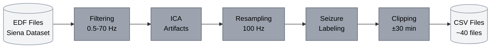
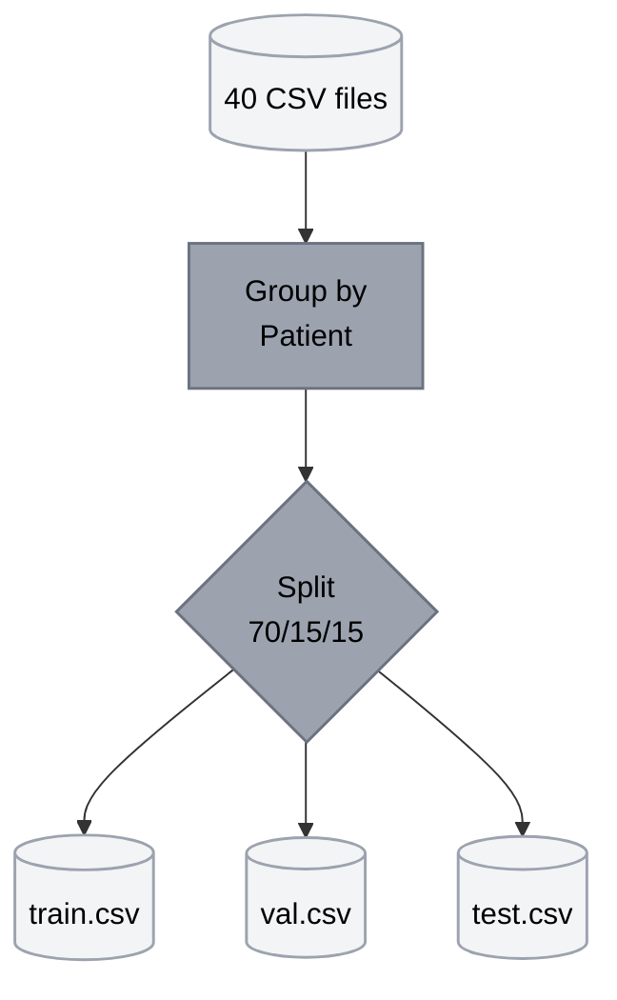
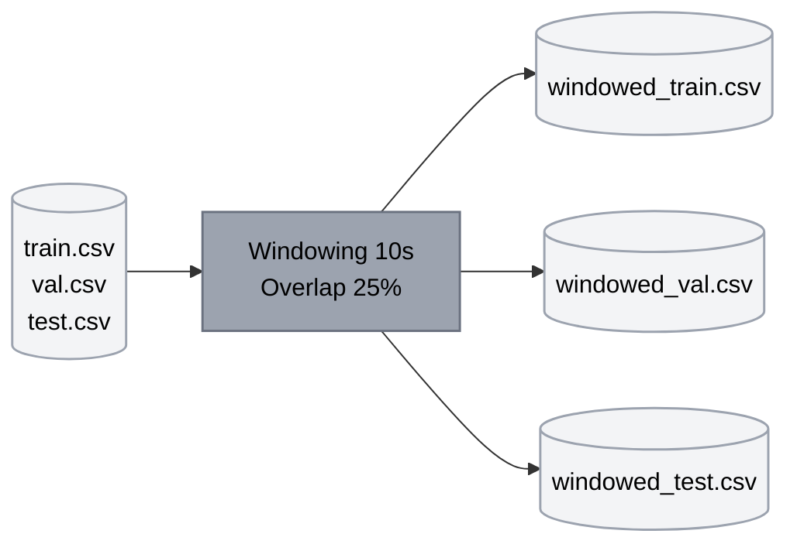

# EEG Data Processing Pipeline

## Step 1: Conversion and Preprocessing



**Input:** Raw EDF files from Siena dataset  
**Processes:** Filtering → ICA → Resampling → Labeling → Temporal clipping  
**Output:** ~40 preprocessed CSVs in `data/raw/csv-data/`

---

## Step 2: Dataset Split



**Input:** Individual CSV files per session  
**Processes:** Patient-level grouping → Stratified split (no data leakage)  
**Output:** 3 consolidated files in `data/processed/dataset_clipped/`

---

## Step 3: Window Generation



**Input:** Concatenated datasets (train/val/test)  
**Processes:** Sliding windows of 10s with 25% overlap  
**Output:** Windowed datasets ready for ML/DL in `data/processed/windowed/`

---

## Technical Specifications

| Parameter | Value |
|-----------|-------|
| EEG Channels | 22 (10-20 system) |
| Sampling Rate | 100 Hz |
| Window Size | 10s (1000 samples) |
| Data Reduction | ~60-80% after clipping |

## Usage

```bash
python data.py                   # Complete pipeline
python data.py --step conversion # Step 1 only
python data.py --step concat     # Step 2 only
python data.py --step window     # Step 3 only
```
