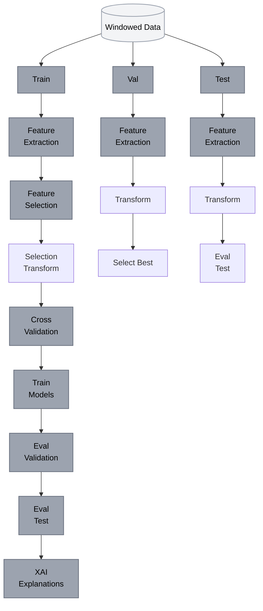

# ML Experiments Flow Diagram



**Pipeline Steps:**
1. **Split** windowed data → train/val/test (70/15/15)
2. **Feature extraction** TSFRESH ~800 features, fit selector on train
3. **Feature selection** SelectKBest fit on train, transform all sets
4. **Cross validation** StratifiedKFold + hyperparameter tuning on train
5. **Train models** LR, RF, SVC, KNN, XGBoost with best params
6. **Eval validation** train + val → select best model
7. **Eval test** best model + test → final metrics + XAI (SHAP, LIME)

---

## Technical Specifications

| Component | Details |
|-----------|---------|
| **ML Algorithms** | Logistic Regression, Random Forest, SVC, KNN, XGBoost |
| **Feature Extraction** | TSFRESH (~800 time-series features) |
| **Feature Selection** | SelectKBest with ANOVA F-test |
| **Cross Validation** | StratifiedKFold (5 folds) |
| **Optimization** | Optuna with TPE sampler |
| **XAI Methods** | SHAP global importance, LIME local explanations |
| **Metrics** | Accuracy, Precision, Recall, F1-Score, ROC-AUC |

## Usage

```bash
cd experimentation/classic
python ml_experiments.py
```

**Configuration:** `experimentation/classic/config.yaml`
